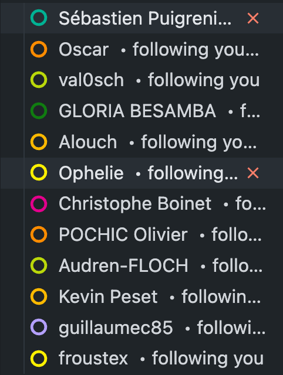

# TP Groupe

[x] Créer une nouvelle React CodeSandbox

[x] Dans le composant App, gérez un état ‘showClock’ à l’aide de crochets. Afficher un bouton qui sera utilisé pour basculer l’état ‘showClock’ (qui basculera le rendu d’un composant <Clock>)

[x] Créer un composant fonctionnel <Clock />

[x] Dans ce dernier cas, utilisez le crochet useState() pour gérer un état « date » initialisé avec un nouveau Date()

[x] Afficher la date dans <Clock />

[x] Dans <Clock />, utilisez le hooks useEffect() pour lancer un setInterval qui mettra à jour la date toutes les secondes (en utilisant le paramètre retourné par le hooks useState()). Enregistrez l’intervalle de configuration dans la console avant d’appeler setInterval().

[x] Enregistrer l’intervalle de compensation dans la console et appeler clearInterval lorsque le composant <Clock/> démonte.

[x] Jouer avec le bouton à bascule et observer ce qui est enregistré dans la console

## Cycle

Temps : 2min

Nous avons le droit à la doc

